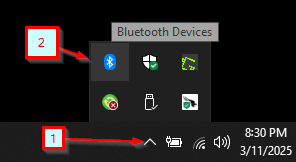
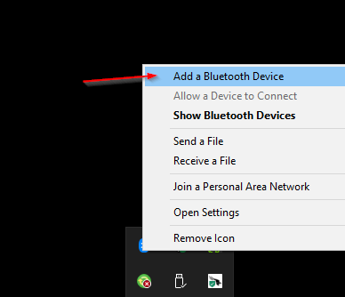
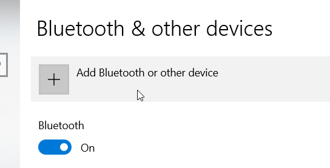
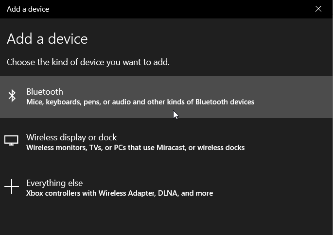
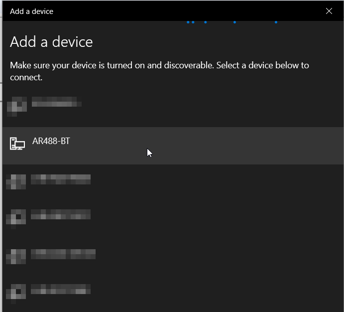
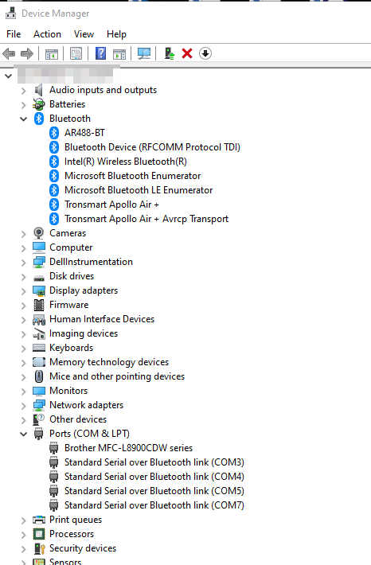
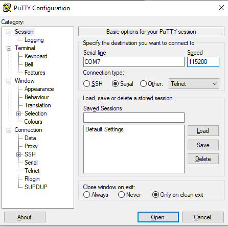
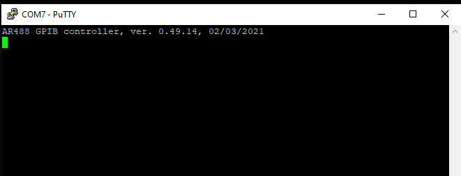

# _Desktop Configuration_

On a Windows machine, Locate the Bluetooth icon in the task bar.

Click on the icon, and select the 'Add a Bluetooth Device' menu option.

Click on the 'Add Bluetooth or other device' selection.

Click on the 'Bluetooth - Mice, keyboards, pens, or audio and other kinds of Bluetooth devices' option.

Windows will search for the Bluetooth device.  The default name of the device is AR488-BT.  Click on this once Windows locates it.

Windows will now add the device. This may take several seconds.

When complete, the device will show up in the task manager in 2 places - It will show the AR488-BT device in the Bluetooth section, and 2 serial ports will be added to the 'Ports (COM & LPT)' section.

Based on my experiences, you will want to select the higher port number.  

As an example, I am able to connect using a speed of 115200 using Putty. 

Issue the **++ver** command to confirm you receive a response.

